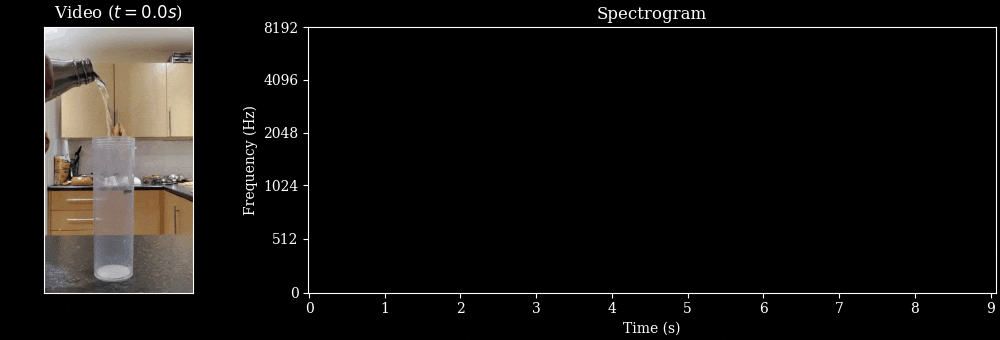

# 🚰 The Sound of Water: Inferring Physical Properties from Pouring Liquids

In this folder, we provide the following trained model checkpoints:

<p align="center">
  
</p>

*Key insight*: As water is poured, the fundamental frequency that we hear changes predictably over time as a function of physical properties (e.g., container dimensions).

**TL;DR**: We present a method to infer physical properties of liquids from *just* the sound of pouring. We show in theory how *pitch* can be used to derive various physical properties such as container height, flow rate, etc. Then, we train a pitch detection network (`wav2vec2`) using simulated and real data. The resulting model can predict the physical properties of pouring liquids with high accuracy. The latent representations learned also encode information about liquid mass and container shape.

Arxiv link: https://arxiv.org/abs/2411.11222

## Demo

Check out the demo [here](https://huggingface.co/spaces/bpiyush/SoundOfWater). You can upload a video of pouring and the model estimates pitch and physical properties.


## 💻 Usage 

First, install the repository from `github`.

```sh
git clone git@github.com:bpiyush/SoundOfWater.git
cd SoundOfWater
```

Then, install dependencies.

```sh
conda create -n sow python=3.8
conda activate sow

# Install desired torch version
# NOTE: change the version if you are using a different CUDA version
pip install torch==2.1.0 torchvision==0.16.0 torchaudio==2.1.0 --index-url https://download.pytorch.org/whl/cu121

# Additional packages
pip install lightning==2.1.2
pip install timm==0.9.10
pip install pandas
pip install decord==0.6.0
pip install librosa==0.10.1
pip install einops==0.7.0
pip install ipywidgets jupyterlab seaborn

# if you find a package is missing, please install it with pip
```

Then, use this snippet to download the models:

```python
from huggingface_hub import snapshot_download

snapshot_download(
    repo_id="bpiyush/sound-of-water-models",
    local_dir="/path/to/download/",
)
```

To run our models on examples of pouring sounds, please see the [playground notebook](https://github.com/bpiyush/SoundOfWater/blob/main/playground.ipynb).

If you would like to use our dataset for a different task, please download it from [here](https://huggingface.co/datasets/bpiyush/sound-of-water).

## Models

We provide audio models trained to detect pitch in the sound of pouring water.
We train these models in two stages:

1. **Pre-training on synthetic data**: We simulate sounds of pouring water using [DDSP](https://arxiv.org/abs/2001.04643) using only 80 samples. This is used to generate lots of simulated sounds of pouring water. Then, we train `wav2vec2` on this data.
2. **Fine-tuning on real data**: We fine-tune the model on real data. Since real data does not come with ground truth, we use visual co-supervision from the video stream to fine-tune the audio model.

Here, we provide checkpoints for both the stages.

<table style="font-size: 12px;" class="center">
  <tr>
    <th><b> File name </b></th>
    <th><b> Description </b></th>
    <th><b> Size </b></th>
  </tr>
  <tr>
    <td><a href="https://huggingface.co/bpiyush/sound-of-water-models">dsr9mf13_ep100_step12423_synthetic_pretrained.pth</a></td>
    <td>Pre-trained on synthetic data</td>
    <td>361M</td>
  </tr>
  <tr>
    <td><a href="https://huggingface.co/bpiyush/sound-of-water-models">dsr9mf13_ep100_step12423_real_finetuned_with_cosupervision.pth</a></td>
    <td>Trained with visual co-supervision</td>
    <td>361M</td>
  </tr>
</table>


<!-- Add a citation -->
## 📜 Citation

If you find this repository useful, please consider giving a star ⭐ and citation

```bibtex
@article{sound_of_water_bagad,
  title={The {S}ound of {W}ater: {I}nferring {P}hysical {P}roperties from {P}ouring {L}iquids},
  author={Bagad, Piyush and Tapaswi, Makarand and Snoek, Cees G. M. and Zisserman, Andrew},
  journal={arXiv},
  year={2024}
}

@inproceedings{
      bagad2024soundofwater,
      title={The {S}ound of {W}ater: {I}nferring {P}hysical {P}roperties from {P}ouring {L}iquids},
      author={Bagad, Piyush and Tapaswi, Makarand and Snoek, Cees G. M. and Zisserman, Andrew},
      booktitle={ICASSP},
      year={2025}
}
```

<!-- Add acknowledgements, license, etc. here. -->
## 🙏 Acknowledgements

* We thank Ashish Thandavan for support with infrastructure and Sindhu
Hegde, Ragav Sachdeva, Jaesung Huh, Vladimir Iashin, Prajwal KR, and Aditya Singh for useful
discussions.
* This research is funded by EPSRC Programme Grant VisualAI EP/T028572/1, and a Royal Society Research Professorship RP / R1 / 191132.

We also want to highlight closely related work that could be of interest:

* [Analyzing Liquid Pouring Sequences via Audio-Visual Neural Networks](https://gamma.cs.unc.edu/PSNN/). IROS (2019).
* [Human sensitivity to acoustic information from vessel filling](https://psycnet.apa.org/record/2000-13210-019). Journal of Experimental Psychology (2020).
* [See the Glass Half Full: Reasoning About Liquid Containers, Their Volume and Content](https://arxiv.org/abs/1701.02718). ICCV (2017).
* [CREPE: A Convolutional Representation for Pitch Estimation](https://arxiv.org/abs/1802.06182). ICASSP (2018).

## 🙅🏻 Potential Biases

Our model is based on `wav2vec2` which is trained on a large-scale speech recognition data. While this data is not as large as usual datasets in AI, it may still have undesirable biases that are present in the training data.